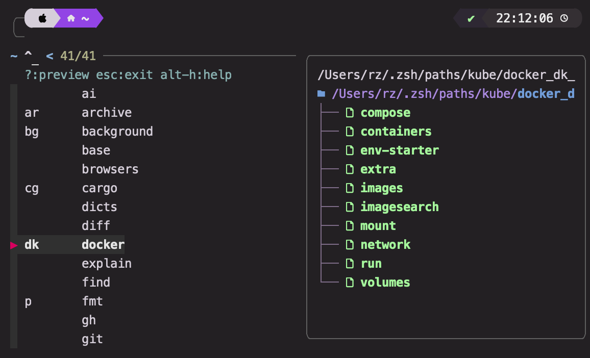
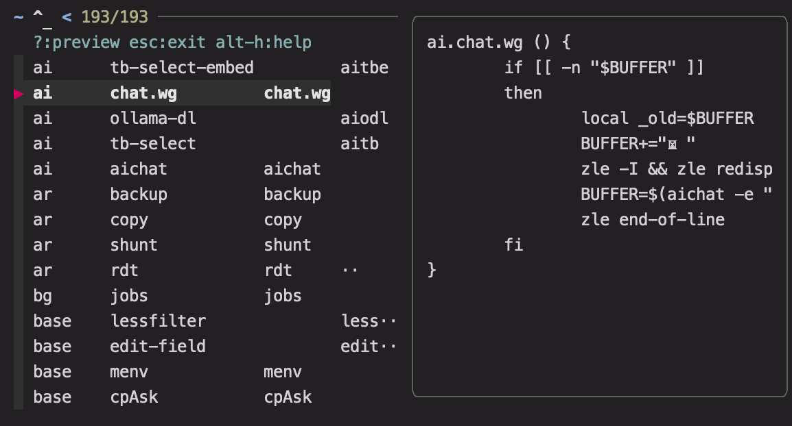
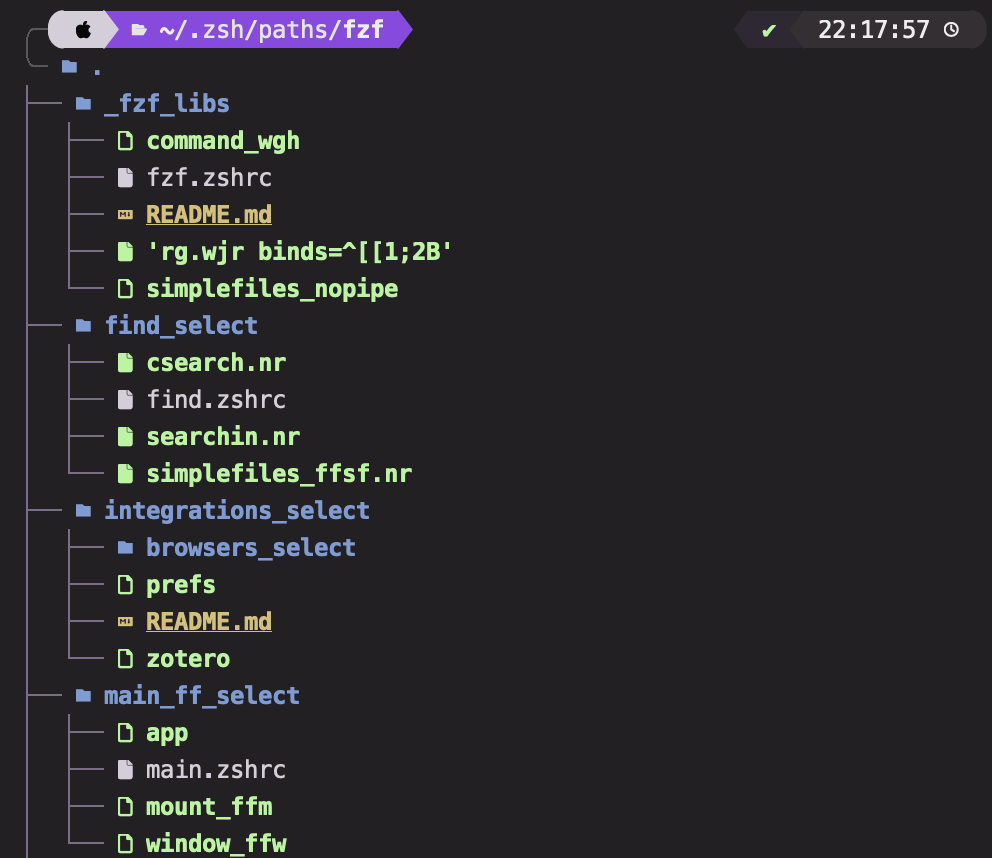
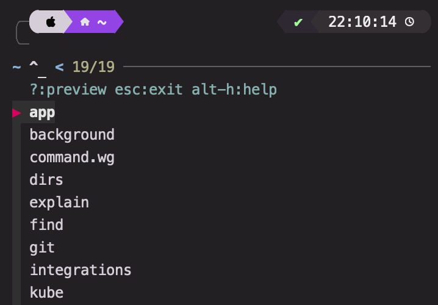
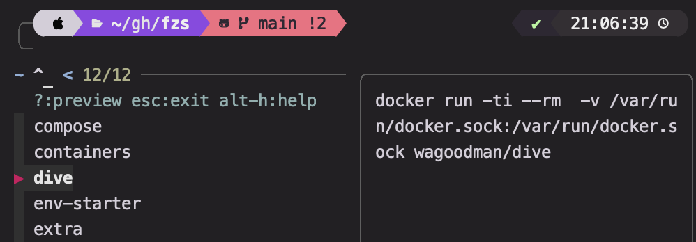

# FZS

FZS is a fuzzy selector for your binaries.

It generalizes the function of launchers like rofi and alfred/raycast.
Using the concept of a [plugin](#plugin) to group related [actions](#action), it allows you to access any of your binaries/scripts/shell functions/aliases **within 2-3 keystrokes** in the vast majority of cases.

> [!NOTE]
>
> It does this by auto-accepting based on the starting substring.
>
> If there is no starting substring match, the selector falls back to fuzzy selection.
>
> - Enter/Space can be used to manually accept.

 

<caption><i>actions can do anything from launching apps, to managing docker containers, to selecting windows, to running tasks in the background, to selecting files to checkout from git...</i></caption>
</br>

</br>

FZS was defined to be simple, hackable, modular and portable. It uses a few rules to parse your plugin folders and convert the contents into functions. Using the parsed structure, it creates:

- a folder of executables which get added to your PATH
  - ...allowing you to autocomplete your (now namespaced) actions
- a short initialization script providing some base functionality.
- and fully customizable individual selectors for each plugin.
  - ...built from by supplying the parsed content to a template, which is itself customizable, as are most other things.

> [!NOTE]
>
> Once the creation is done, fzs gets out of your way. 
>
> - It leaves your files untouched, and **doesn't necessitate any specific changes or extra work in your setup to accomodate it, beyond sorting your commands and scripts into plugin folders**.
>   - However, it does make use of an optional special naming format which allows you to specify finer details about your commands.
> - The finished initialization scripts are pure compiled zsh, and and take less than <1ms on an M1.

**Other features** include:

- Turning functions into zle [widgets](#flags), (allowing you to modify your command line on the fly or access them through keybinds)
- Auto-compile your source code (In progress)
- Declutter your PATH while keeping everything organized
  - This is can really impove your computer's performance
- Complete and helpful error checking, together with an optimized mode that can be run on shell startup to auto-update (In progress)
- ...[More features](#Flags)

# Concepts

FZS is mainly an organizational framework. Related actions are grouped into *Plugins*, which live as folders within a `FZS_ROOT_DIR` (default: `~/.fzs`) on your machine.



A folder is treated as a Plugin if its name matches a `plugin_regex`. The root directory scans for plugins non-recursively, and for each, the following happens:

> [!NOTE]
>
> By default, this is `^([a-zA-Z0-9]+)(?:_([a-zA-Z0-9-]+))?(?:_([a-zA-Z0-9-]+))?_select$` ([See](#Structs)). That means it any folder that looks like `name_alias?_description?_select` will become a Plugin with the fields of `name, alias, description`. 
>
> - The name of the plugin should be a unique (descriptive) identifier
> - The alias of a plugin is the actual namespace the plugin's actions get put under.
>   - For example, an executable `dlv` living inside a folder `video_v_video-plugins_select`, is accessible using [`v.dlv`](#Finally,-downloading-plugins), or `v.<TAB>` if you have autocomplete.
>   - Defaults to name if not provided.
>   - Aliases need not be unique, so that you may combine multiple related plugins.
> - The description is shown sometimes when using certain selectors/autocomplete functions.

The plugin is populated with executables from its folder matching the `fn_regex`.
The functions get symlinked to fn_template (Default: `{{ pg_alias }}.{{ name }}`).

> [!NOTE]
>
> By default, this is, `^(_*[a-zA-Z0-9-]+)(?:_([a-zA-Z0-9-]*))?(?:_([a-zA-Z0-9-\(\)_ ]+))?(?:\.[a-zA-Z0-9,\. ]+)?` meaning that any executable that looks like `name_alias_description.modifiers(.ext)?` gets parsed into the expected function, which is included in a plugin selector, and shown below.
>
> - Modifiers make it easy for you configure extra behavior your functions without resorting to a config file, at the expense of weird file names.

 

Plugins can also be configured in non-executable files with a specific extension within the associated directory (Default: `.zshrc`), allowing you to effortlessly include your aliases and shell functions (more on that below).

> [!NOTE]
>
> There is also neutered version of a plugin, called a linkedbin. It parses a pattern of `_name_description?`, and namespaces your functions in that folder, but the executables under it do not get added to the selector. Note that if you use a `name` which collides with an existing plugin, the linkedbin is merged with that plugin, and its functions are accessible under the `alias` of that plugin.
> 	Essentially, it just auto-adds the `NA` [flag](#NA) to every parsed executable.
>
> This is helpful for helper scripts, you may choose to use a folder name like `_docker_libs` or `_provision_terraform-libs`.

Next, the `.zshrc` files are scanned for lines beginning with `# :`. Include this above your function, named like `$name_alias?_description?` (The same `fn_regex`, but prefixed with a `$`), and your function will be included in the plugin, just like an actual binary.

> [!NOTE]
>
> ZSH variable declaration rules means you are a limited to valid characters which don't include `-`, but you can get around it by overriding the name on the hash line, using the CMD flag, or using a different namingScheme.

Finally, fzs handles the rest, and creates:

- A plugin selector
- A selector for all parsed functions (even linkedbins)
- Selectors for all your plugins
- Various widgets, keybinds, aliases associated to your actions

The rest is up to the plugins you choose.

##### Modifiers

The hash line allows further options, in general, you may use the form `# : FLAG1,...FLAGN name=nothing-nice alias=tosay cmd=echo binds=^E desc=say nothing at all`
These field=value tokens are called *modifiers*, and are space seperated, except for `desc`, which must be the last if present.

The are allowed on executable filenames too, after the first period. i.e. `rg.wjr binds=^[[1;2B` will allow you to call your rg script using `shift-down`. (This format for parsing is non-configurable, but these options can also be set through a config file).

# Guide

## Installation

1. Install [fzf](https://github.com/junegunn/fzf?tab=readme-ov-file#installation)
   - You may want to configure `FZF_DEFAULT_OPTS` as well ([See](#usage tips)).
2. One of:

```shell
cargo install fzs
```

3. Optionally, install:
   - [bat](https://github.com/sharkdp/bat)/[eza](https://github.com/eza-community/eza) to improve fzf preview experience.
     - Add the following to your config:
       - `fzf_dir_cmd = "eza -T -L 2 --icons --color=always ${@}"`
       - `fzf_pager_cmd = "bat -p --color=always --terminal-width \\$FZF_PREVIEW_COLUMNS"`
   - [pueue](https://github.com/Nukesor/pueue) to allow running commands in background.
     - Use the `PBG` flag to enable this on a compatible action.

## Configuration

Put your binaries and shell functions in `FZS_ROOT_DIR` (default: `~/.fzs`)

The config file lives in `~/.config/fzs` or can be supplied with `fzs --config <filepath>` (todo). Check [Structs](#structs) for all available options.

- Note that any useful plugin setting can also be configured using modifiers and decorators, so that only the `[settings]` block is needed.
- The config file can however, override any values set in the scanning stage.
- For example:

```toml
[[plugins]]
name = "pijul"
alias = "pj"
fns = [
    { name="diff", alias="pjd", cmd="pj diff | bat -l diff" }, # available as pj.diff or pjd
    { name="log-hashes", alias="pjlh", cmd='pijul log --hash-only' },
    { name="changes", FLAGS="WJSUB" }, # Adds the output of the pj.changes to your command line buffer
    { name = "pull", binds = [ "^x^p" ] }, # (turns the binary pj.pull, which must be defined elsewhere, into a widget, and) adds the ^x^p keybind to call it. Use cat -v to find your keybind keycode. 
    { name = "push", flags = [ "PBG" ] } # Runs pj.push in the background when selected, requires pueue
]

[[plugins]]
name = "eza"
fns = [
    { name="list-all", cmd="eza -la", bind='^[OQ' },
    { name = "find", flags = [ "PG" ] }, # adds the find plugin to the eza_selector
]

# MAIN
# This is one I actually use. Having each option start with a different letter makes selection quicker.
[[plugins]]
name = "main"
alias = "m"
fns = [
    { name = "command.wg", alias="ffex", flags = [ "WG" ], binds = ["^[^X"] }, # defined as a widget in, say, $HOME/.zsh/paths/main_select/main.zshrc
    { name = "background", flags = [ "PG" ] }, # lives as background_select somewhere inside `root_dir`
    { name = "explain", flags = [ "PG" ] },
    { name = "find", flags = [ "PG" ] },
    { name = "git", flags = [ "PG" ] },
    { name = "integrations", flags = [ "PG" ] },
    { name = "kube", flags = [ "PG" ] },
    { name = "l", flags = [ "PG" ] },
    { name = "ranger", flags = [ "PG" ] },
    { name = "monitor", flags = [ "PG" ] },
    { name = "network", flags = [ "PG" ] },
    { name = "peek", flags = [ "PG" ] },
    { name = "system", flags = [ "PG" ] },
    { name = "vid", flags = [ "PG" ] },
]
binds = [ "^[w" ]

[settings]
root_dir = "$HOME/.zsh/paths"
plugin_selector_binds = [ "^[p" ]
fzf_dir_cmd = "eza -T -L 2"
fzf_pager_cmd = "bat -p --color=always --terminal-width \\$FZF_PREVIEW_COLUMNS"
```

## Finally, downloading plugins

A window, app, file, directory, quick peek launcher can be found [here](https://github.com/Squirreljetpack/fzs-basic-plugins).

1. Clone it into  `FZS_ROOT_DIR`
2. (Migrate/download other plugins)
3. Run fzs
4. Paste the output into your `.zshrc`
5. Run `exec zsh`
6. Activate the default selectors with `^]f`, `^]p` ! (Make sure they aren't overridden).

# Usage tips

Bind a key to switch to terminal and activate your "main" selector.
On mac, this requires Karabiner or shkd (and yabai if you need instant desktop switching). Here is my karabiner json:

```json
{
    "conditions": [
        {
            "bundle_identifiers": [
                "^com\\.apple\\.Terminal$",
                "^com\\.googlecode\\.iterm2$",
                "^co\\.zeit\\.hyperterm$",
                "^co\\.zeit\\.hyper$",
                "^io\\.alacritty$",
                "^org\\.alacritty$",
                "^net\\.kovidgoyal\\.kitty$",
            ],
            "type": "frontmost_application_unless"
        }
    ],
    "from": {
        "key_code": "w",
        "modifiers": { "mandatory": ["control", "left_option"] }
    },
    "parameters": { "basic.to_delayed_action_delay_milliseconds": 200 },
    "to": [
        { "shell_command": "/opt/homebrew/bin/yabai  -m space --focus 7" }
    ],
    "to_delayed_action": {
        "to_if_canceled": [
            {
                "key_code": "w",
                "modifiers": ["right_option"]
            }
        ],
        "to_if_invoked": [
            {
                "key_code": "w",
                "modifiers": ["right_option"]
            }
        ]
    },
    "type": "basic"
},

```

On Linux, it's a lot easier and smoother:

```
 (todo)
```


> [!NOTE]
>
> You may also need to include `yabai -m signal --add event=space_changed action='yabai -m window --focus $(yabai -m query --windows --space | jq -r '\''[.[]|select(."is-visible")][0].id'\'')'` if you are selecting by space.

- Having each option start with a different letter makes selection quicker.
- To set define a "default action" for your plugin, you may want to use a name for the action sharing the same first letter with the plugin, so that you can double-tap to activate.

fzs also treats a plugin whose name is `base` as a special case:

- The executables inside are not namespaced (The `fn_template` is not applied to them)
- All executables within are detected, not just 

So i.e., you could just drop/symlink all your existing extra `$PATH` directories in here, and use fzs as just a selector for them, *if you wish*.

You may want to implement some shared keybinds on fzf:

```zsh
export FZF_DEFAULT_OPTS="
--info=inline
--preview-window=:hidden:cycle
--cycle
--ansi
--preview 'lessfilter {}'
--prompt='∼ ' --pointer='▶' --marker='✓'
--bind '?:toggle-preview'
--bind 'ctrl-a:select-all'
--bind 'ctrl-y:execute-silent(echo {+} | pbcopy)' # your clipboard command of choice
--bind 'ctrl-o:execute(o {1})' # open -a if you're on mac, xdg-open if on linux
--bind 'alt-o:execute($EDITOR {1})'"
```

# Alternatives

- Rofi
- Alfred
- Raycast
- fzf-tab

## Comparison

TODO

# Structs


## Plugin

```rust
struct Plugin {
    name: String,
    alias: Option<String>,
    desc: Option<String>,
    fns: HashMap<String, Action>,
    sources: Vec<PathBuf>,
    binds: Vec<Keybind>,
    // not recommended to set
	path: PathBuf
    fn_template: Option<String>,
    fn_table_template: Option<String>,
}
```

## Fun

```rust
struct Fun {
    name: String,
    alias: Option<String>,
    desc: Option<String>,
    cmd: Option<String>,
    flags: FnFlags,
    binds: Vec<Keybind>,
}
```

## GlobalConfig

```rust
struct GlobalConfig {
    root_dir: PathBuf,  // the directory to scan
    path_dir: PathBuf,  // where your binaries are symlinked to
    config_dir: PathBuf, // not available in .config
    data_dir: PathBuf,  // where the resultant initialization scripts live
    plugin_regex: Regex, // The regex used to detect plugins. Supports name alias? desc? as the capturing groups in order
    linkedbin_regex: Regex, // The regex used to detect linkedbins. Supports alias? desc? as the capturing groups in order
    fn_regex: Regex, // The regex used to detect actions. Supports name alias? desc? as the capturing groups in order
    name_from_cmd_regex: Regex, // When decorated with # CMD, the following command declaration is parsed into an action using this name. See # Templates.
    name_from_alias_template: String, // When decorated with # AL, the following alias declaration is parsed into an action using this name. See # Templates.
    selector_widget_template: String, // The name for a selector widget
    fn_template: String, // What a binary gets symlinked to
    fn_table_template: String, // The format used to pass a function into the fzf selector, see # Templates
    all_fn_table_template: String, // The format used to pass a function into the fzf selector for all functions, see # Templates
    template_file: PathBuf, // The template file used to build a selector widget. Allows for full customization of the selector behavior. One is created by default in config_dir if not specified.
    init_file: PathBuf, // The path to use for the generated file which initializes fzs and sources your .zshrc scripts, relative to `data_dir`.
    fzs_name: String,  // The namespace for fzs related helper shell functions
    generated_file: PathBuf,  // The path to use for the generated file which initializes plugins, relative to `data_dir`.
    plugin_selector_binds: Keybinds,  // The keybinds to activate the selector for all plugins (default: ^[p)
    all_fn_selector_binds: Keybinds, // The keybinds to activate the selector for all functions (default: ^[f)
    fzs_fzf_dir_cmd: String,  // Templated into the init_file to configure which command is used to preview a directory (default: ls -la)
    fzs_fzf_pager_cmd: String, // Templated into the init_file to configure which command is used as a pager (default: less -RX)
    fzs_fzf_base_preview: String, // Templated into the init_file to configure which command is used as a pager (default: source $fzs_init_file > /dev/null 2>&1; source $fzs_plugins_file > /dev/null 2>&1; which -a {3})
    // This sources your functions so that all definitions are available. The effect should not be noticable
}
```

## Flags

```rust
enum FnFlag {
    WG, // Widget: Just makes the selector invoke this function with zle. This should target an existing widget.
    WJR,  // Creates a widget from the target. Adds the current command-line to the stack and replaces it with the target's command, but does not execute (allowing the user to supply arguments).
    WJSUB,  // Same as above, but the output is added to the command line buffer.
	WR,   // Creates a widget from the target.
    WSUB, // Creates a widget from the target. The output is added to the command line buffer. 
    PGI, // flatmap's the target plugin's actions into the containing plugin.
    PBG, // Replaces the function such that calling it will run it in the background. (Requires pueue).
    PG, // Plugin
    SS, // Subshell: When selected, runs the command in a subshell
    RP, // RestorePrompt: When selected, after the command is run, the initial prompt is restored.
    NC, // NoClean: When selected, after the command is run, no cleanup is performed after running the command. (By default, a new prompt is created). Use this if your widget handles cleanup.
    NA, // NoAdd: The default flag for an executable in a linkedbin folder.
    NR, // NR: When selected, fzs will not run the command, only add it to your command line buffer.
    NN, // The function is not namespaced, you can call it directly by it's name
    CMD, // Only inside .zshrc: Treats the following function declaration literally, rather than attempting to parse it with fn_template. (A name is chosen from it using name_from_cmd_regex).
    AL, // Only inside .zshrc: Use it above a line of the form: alias name='echo hi'. It will add it to your plugin with a name built from name_from_alias_template.
}
```


# Templates

fzs builds the resulting functions from the parsed structure using templates. Here are the defaults:

- *fn_template*: `{{ pg_alias }}.{{ name }}`

- *selector_widget_template*: `{{ alias }}._select.wg`

The last two have to do with the how the lines describing each action which are fed into the `$fzs_name._base-select.wg/$fzs_name.all-fn-select.wg` are built (See `fzs_init.zsh` in the source code):

- *name_from_alias_template*: `{{ alias }}.al`
- `{{ name }}  {{ flags }} {{ cmds }}  {{ desc }}`
- all_fn_table_template: `{{ pg_alias }}		{{ cmds }}	{{ name }}	{{ alias }}	{{ desc }}`

## source files

fzs also provides the variables `this=plugin_alias, this_name=plugin_name` when sourcing your `.zshrc` files, which may aid you in defining your functions. For example, the following snippet runs the current command line using pueue:

```zsh
# : CMD,WG
$this.add.wg() {
    pueue add -- $BUFFER
    zle reset-prompt
    zle kill-buffer
}

zle -N $this.add.wg
bindkey '^[z' $this.add.wg
```

- The use of `CMD` is because `$add.wg` is not a valid variable name and fzf won't be able to supply the actual name correctly.

FZS does not template your `.zshrc` files!
Advantages:

- Your scripts remain valid zsh, allowing editors to work as normal
- FZS only has to do very few write operations, and can be run at every shell startup if desired, ensuring your setup is always up to date.

Disadvantages:

- Doesn't provide true modularity for your scripts, so that renaming your plugin may break functions that rely on it. In particular, [`$this`](#source files) cannot be used within a function.[^1]

# FAQ

- Do not make sourced files executable (You can use `fd -g "*.zshrc" -t x -x chmod -x`)
- When parsing fns from files, the available function characters are limited to A-Za-z0-9_ due to shell syntax. You can use the config.toml to override if necessary. It is also recommended to use camelCase if your name or alias consists of multiple words.
- Use the [base plugin](#Usage tips) to gather binaries without namespacing
- If your binds don't register, make sure to load your fzs_plugins file(s) after other zsh plugins
- How to always properly fold fzf preview?
  - I don't know ... `fold -w \${FZF_PREVIEW_COLUMNS}` works okay sometimes.
- fzs works well in conjunction with fzs-tab: type your plugin prefix, and you can search through all registered bins under it.
- Some flags are incompatible
  - (Todo) Working on covering every case with an explanatory error message.
- Why use `.`  and `_` as delimiter rather than say, `::` which is recommended by google?
  - `:` shouldn't be used in filenames, as it's not supported on mac.
  - `.` is easy to type, and is used in many languages to `namespace` things.
  - The choice of delimiter is not fixed, you are free to configure it.


[^1]: FZS also provides `this(){echo ${${funcstack[2]}%%.*};}` which can used to refer to the current plugin's alias inside a function one level deep if the default fn_template is kept, but this is clearly not advised. 

# Todo

- [ ] Release
  - [ ] Github actions (Upload release)
  - [ ] CHANGELOG
  - [ ] Refactor
  - [ ] Tests on all platforms
  - [ ] Wiki
- [ ] Extra features
  - [ ] Refactor!
    - [ ] Rename fun to action
    - [ ] a `--quick` mode that skips checks and uses caching
    - [ ]  `--quick` should be able to run on shell startup (<0.05 seconds)
  - [ ] More options to autoconfigure widgets from file
  - [ ] Explain eval \$cmd in README
  - [ ] Frequency sort
  - [ ] Make one-accept an option over default
  - [ ] More widget modes
  - [ ] template out fzf_help_cmd
  - [ ] .zshrc and other formats: .c, rust, etc?
  - [ ] Would be nice to also bring functions defined elsewhere under a snippet, we could have a macro # : target=have which can do this + add conditionally check existence to decide whether to add to fn_table during runtime
  - [ ] git hook example
  - [ ] Properly format columns
  - [ ] Extend structures
    - [x] Flatmap plugins
    - [ ] Composition
    - [ ] Functional programming stuff
  - [ ] Cow for functions